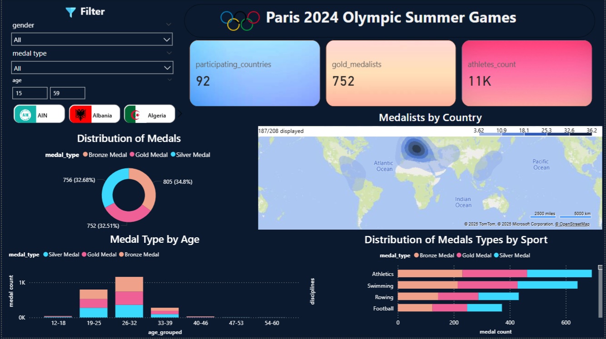

# Paris 2024 Olympic Games Data Visualization 
## Description
We were tasked to integrate and visualize [datasets](https://www.kaggle.com/datasets/piterfm/paris-2024-olympic-summer-games) about the 2024 Olympic Games in Paris using PowerBI to derive insights about the games. 

## Key Features
### Data Integration
Using PowerBI we integrated multiple tables together to create a larger more comprehensive database on atheletes to be able to create more interesting visualizations. 
### Data Cleaning and Feature Engineering
After integrating the data we performed some data cleaning tasks as well as feature engineering to simplify visualizations on our dashboard.
### Research Questions 
We came up with a total of 12 Questions which we used insights from our Dashboard to answer. They ranged from simple distribution questions that could be directly sampled from a visualizatoin, to larger questions that required some research beyond our visualizations. 
### Dynamic Dashboards
In our Final Dashboard not only did we add many different kinds of visualizations to get insights from, we also allowed them to be dynamic by adding splicers by country, age range and gender that allow users to extract even more valuable conclusions from our data. 
### Final Report
Finally we created a report on overleaf using LaTex to answer out questions and show the insights we gained in a more cohesive and detailed manner. 

## Dashboard Overview 
### Page 1

### Page 2

